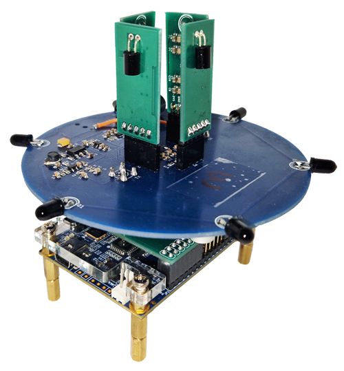

# Harmony: A Time Synchronisation System for VLC Access Points

## About
This repository contains the implementation files for the paper titled **Harmony: A Time Synchronisation System for Visible Light Communication Access Points** published in ACM SenSys 2022. Access the paper here.

## Electronic Hardware

The electronic hardware consists of three modules.
* OWC Receiver module
* OWC Transmitter module
* ADC & DAC module

## Digital Hardware

The digital hardware implementation is done in Verilog.

**Note:**

The electronic and digital hardware implementations are fast-developed prototypes. Therefore, the implementations have several places which can be optimised.